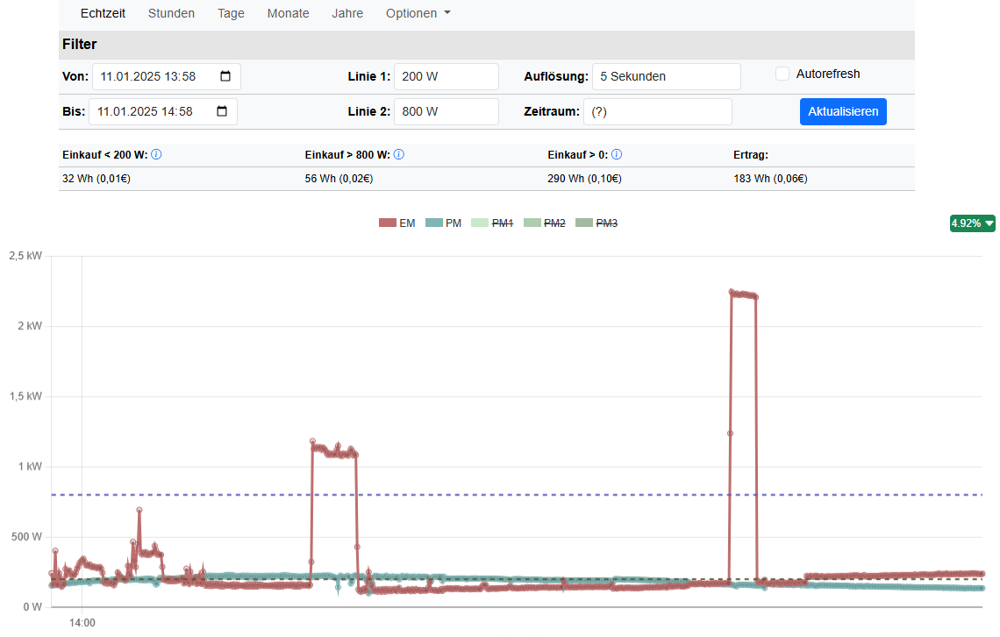

# Energie-Visualisierung für zu Hause

Zur Bildergallerie [gallery.md](gallery.md)

## Beschreibung

Mit der Energie-Visualisierung können sowohl Echtzeitdaten als auch manuell eingegebene Energiewerte (Verbrauchs- und selbst erzeugte Energie) visuell dargestellt werden. Dafür stehen verschiedene Ansichten zur Verfügung: Echtzeitdaten, Stunden-, Tages-, Monats- und Jahresübersichten.

Die Preisberechnung erfolgt anhand der für den jeweiligen Zeitabschnitt eingegebenen Preisdaten. Dadurch ist es möglich, historische Energiedaten unter Berücksichtigung der damals gültigen Preise abzulesen.

### Zielsetzung

Das Projekt richtet sich an technisch erfahrene Benutzer, die ihren privaten Echtzeit-Energieverbrauch und/oder ihre private Echtzeit-Stromerzeugung durch PV-Anlagen, Balkonkraftwerke oder andere Energieerzeuger im Detail analysieren möchten. Es ist für die Nutzung am PC optimiert, kann jedoch auch auf einem Smartphone verwendet werden – wobei die Darstellung dort weniger optimal ist.

Beispielsweise können Stromspitzen in Echtzeit erkannt und mithilfe von zwei Berechnungslinien analysiert werden. Dies ermöglicht es, den Energieverbrauch oberhalb, unterhalb oder zwischen den definierten Linien zu ermitteln.

**Beispiel 1:** Wieviel Strom verbrauche ich über 800 Watt, um zu erkennen ob ein Balkonkraftwerk für meine Zwecke ausreichend ist, oder eine größer Anlage besser wäre.

**Beispiel 2:** Wieviel Strom wird unterhalb 200 Watt verwendet. Die kann bei einer konstanten Stromeinspeisung z.B. eines Akkus in der Nacht helfen die optimale Einstellung zu finden.

**Beispiel 3:** Wieviel Strom wird oberhalb 800 Watt und unterhalb 1500 Watt verwendet. Hiermit kann ich rausfinden, inwieweit eine Anhebung meiner Erzeugungsgrenze Sinn macht. 

### Installation

Die Installationshinweise sind hier zu finden [install.md](install.md).

### Energiedaten

Als Energiedaten werden folgende bezeichnet:

#### Gemessene bzw. manuell eingegebene Daten
- **Verbrauchsdaten**: Hiermit sind die selbst verbrauchten Energiedaten gemeint. Diese können entweder am eigenen Stromzähler oder über einen Energiesensor, wie z. B. die Shelly 3 EM-Sensoren mit Skriptunterstützung, in Echtzeit erfasst werden.
- **Erzeugungsdaten**: Dies beschreibt selbst erzeugte Energie, wie z. B. aus PV-Anlagen oder Balkonkraftwerken.

#### Datenspeicherung
In der Datenbank ist pro Zeitabschnitt ein Wert für Verbrauchsdaten vorgesehen, also ein Wert für alle drei Phasen. Für die Erzeugungsdaten ist je Phase ein Wert vorgesehen, sodass alle drei Phasen getrennt gemessen und erfasst werden können.

#### Berechnete Daten
- **Genauigkeit**: Die Berechnung erfolgt entsprechend der Genauigkeit der verfügbaren Daten. Bei Echtzeitdaten im 2-Sekunden-Takt werden die Verbrauchs- und Erzeugungsdaten für jeweils zwei Sekunden miteinander verglichen, und der Preis wird mit dem zu diesem Zeitpunkt gültigen Wert berechnet.
- **Energieersparnis**: Beschreibt die gesparte Energie, also den positiven Anteil der Verbrauchsdaten abzüglich der erzeugten Daten.
- **Netzeinspeisung**: Definiert die überschüssige erzeugte Energie, die nicht selbst verbraucht wird.

### Echtzeitdaten und Daten-Logger
Die Echtzeitdaten und Stundenübersicht sind nur in Verbindung mit Echtzeitdaten sinnvoll nutzbar. Gleiches gilt für die Tagesansicht, da man in der Regel nur Monatsdaten manuell eingibt.  
Für das Datenlogging der Echtzeitdaten gibt es eine API, die diese entgegennimmt und in die Datenbank speichert. Dieses Projekt enthält Skripte für die Shelly-Energiemesssensoren. Bitte unbedingt die Sicherheitshinweise beachten, falls Sensoren genutzt werden, die in die Elektroinstallation eingebaut werden.

Bei mir laufen die Shelly-Skripte im 2-Sekunden-Takt stabil. Bei einer Sekunde kommt es zu Fehlern und Datenverlusten. Es sind Taktungen von 2-6 Sekunden möglich, noch höhere Taktungen werden wahrscheinlich zu ungenau sein.

Generell können kleine Datenlücken auftreten, beispielsweise durch eine instabile WLAN-Verbindung zu den Shellys. Aus diesem Grund wird die Anzahl fehlender Werte teilweise mit angezeigt.

### Aufsummierte Daten und Übersichtsseiten
Die Übersichtsseiten (Stunden-, Tages-, Monats- und Jahresansichten) arbeiten intern mit aufsummierten Echtzeitdaten, um eine schnelle Darstellung zu ermöglichen. Diese werden über einen Cronjob aus den Echtzeitdaten berechnet. Auch manuell eingegebene Daten fließen hier ein.

### Preisdaten
Es können manuell Tagespreise für verschiedene Zeitabschnitte eingegeben werden, die bei der Darstellung und Preisberechnung berücksichtigt werden.  
Die Architektur erlaubt theoretisch Preisdaten im Viertelstundentakt, was eine Anbindung an einen dynamischen Stromtarif ermöglicht. Aktuell gibt es keinen Konnektor dafür. Falls jemand diesen entwickeln möchte, kann er sich gerne bei mir melden.

### Manuell eingegebene Daten
Es ist möglich, Energiewerte für einen Tag oder einen Monat manuell einzugeben. Diese Daten werden auf den Übersichtsseiten angezeigt. Die manuelle Eingabe von Tagesdaten ist für den Fall gedacht, dass bei der Inbetriebnahme des Programms Daten für einen Monat nachgepflegt werden müssen.  
Preisdaten können ebenfalls manuell für mehrere Zeiträume eingegeben werden.

### Status fehlender Werte
Hier wird ein Status angezeigt, der einen Überblick über die Datenabdeckung gibt und die Möglichkeit bietet, fehlende Daten manuell nachzupflegen. Falls bei der Berechnung der Echtzeitdaten ein Fehler beim Cronjob aufgetreten ist, kann der Monat manuell nachberechnet werden. Fehlen allerdings die Echtzeitdaten vollständig, bleibt die Lücke bestehen.

## Lizenz

Dieses Projekt ist unter der [GNU General Public License v3.0](https://www.gnu.org/licenses/gpl-3.0.html) lizenziert. Sie dürfen es verwenden, modifizieren und weitergeben, solange alle Kopien und abgeleiteten Werke ebenfalls unter dieser Lizenz stehen.
Die Lizenz für die verwendeten Bibliotheken ist hier zu finden [third-party-licenses.txt](third-party-licenses.txt).

## Verwendete Fremd-Bibliotheken

Das Projekt nutzt folgende Open-Source-Bibliotheken:

1. **Shelly** - [Shelly Cloud](https://shelly.cloud)
   - **Funktion**: Automatisierung und Steuerung von Geräten durch benutzerdefinierte Skripte.
   - **Verwendete Shelly-Geräte**: 
     - Shelly Pro3EM
     - Shelly Plus1PM
     - Shelly Mini1PMG3

2. **jQuery** - [jQuery](https://jquery.com/)
   - **Funktion**: Ermöglicht interaktive Webanwendungen mit minimalem Aufwand.
   - **Version**: 3.6.0

3. **Bootstrap 5** - [Bootstrap](https://getbootstrap.com/)
   - **Funktion**: CSS-Framework für die Gestaltung responsiver Webseiten.
   - **Version**: 5.3.3

4. **DataTables** - [DataTables](https://datatables.net/)
   - **Funktion**: Erweiterte Tabellenfunktionen wie Sortierung und Pagination.
   - **Version**: 1.12.1

5. **Chart.js** - [Chart.js](https://www.chartjs.org/)
   - **Funktion**: Bibliothek zur Erstellung interaktiver Diagramme.
   - **Version**: 4.4.6

6. **Moment.js** (via Chart.js Adapter) - [Moment.js](https://momentjs.com/)
   - **Funktion**: Datum- und Zeitmanipulation für Diagramme.

7. **Bootstrap Icons** - [Bootstrap Icons](https://icons.getbootstrap.com/)
   - **Funktion**: Sammlung von Icons für die Verwendung in Bootstrap-basierten Webseiten.

## Shelly-Geräte und Skripte

### Verwendung von Shelly-Geräten und -Skripten

Dieses Projekt kann mit Shelly-Geräten verwendet werden, welche Energiedaten messen und diese per Skript versenden können. Hierzu zählen z.B. die Shelly-EM, Shelly-PM sowie der Shelly Plug, in Kombination mit benutzerdefinierten Skripten, die speziell entwickelt wurden, um **Energiedaten auszulesen und an eine API zu übermitteln**. Diese Skripte ermöglichen es, die erfassten Daten in einer Datenbank zu speichern und in Form von **Diagrammen** und **aufaddierten Tabellen** darzustellen.

### Wichtiger Hinweis zur Installation

Gemäß den gesetzlichen Bestimmungen des jeweiligen Landes dürfen die **Shelly-Geräte** welche in in die Elektroinstallation installiert werden müssen **nur von einem qualifizierten Elektriker** installiert werden. Diese Geräte sind für die Messung und Steuerung von Energieverbrauch und -produktion konzipiert, und die Installation erfordert entsprechendes Fachwissen, um sicherzustellen, dass die Geräte korrekt und sicher betrieben werden.

Bitte beachten Sie, dass die Nutzung dieses Systems und der damit verbundenen Skripte voraussetzt, dass die Installation der Shelly-Geräte fachgerecht durchgeführt wurde. Stellen Sie sicher, dass alle elektrischen Arbeiten von einem **zertifizierten Elektriker** durchgeführt werden, um sowohl die Sicherheit als auch die Einhaltung der gesetzlichen Vorschriften zu gewährleisten. Diese Bestimmungen gelten insbesondere in Deutschland, aber auch in anderen Ländern, in denen die Geräte genutzt werden.

### Optionale Nutzung von Shelly

Die Nutzung von Shelly-Skripten ist in dieser App **optional**. Alternativ können Energiewerte auch **manuell eingegeben** werden, ohne Shelly-Geräte zu verwenden. Das manuelle Eingabesystem ermöglicht eine einfache und direkte Erfassung von Energiedaten, wenn keine Shelly-Geräte zur Verfügung stehen oder wenn eine andere Lösung bevorzugt wird.

### Haftungsausschluss

Dieses Projekt stellt die Software zur Verfügung, die mit den Shelly-Geräten arbeitet, übernimmt jedoch **keine Haftung** für die Installation, Nutzung oder eventuelle Schäden, die durch unsachgemäße Installation oder Nutzung der Geräte entstehen könnten. Die Verantwortung für die ordnungsgemäße Installation der Geräte liegt beim Benutzer. 

Ebenso wird keine Haftung für die erfassten Daten, deren Speicherung oder deren Schutz vor unbefugtem Zugriff übernommen. Es obliegt dem Benutzer, geeignete Sicherheitsmaßnahmen zu treffen, um die Integrität und Vertraulichkeit der Daten sicherzustellen.

Darüber hinaus wird keine Verantwortung für etwaige Datenverluste, Abwärtskompatibilitätsprobleme (z. B. nach einem Update) oder andere technische Probleme übernommen. Es wird ausdrücklich empfohlen, regelmäßig ein Backup der Datenbank zu erstellen, um den Verlust wichtiger Informationen zu vermeiden.

**Wichtiger Hinweis**: Die Geräte und Skripte dürfen nur in Übereinstimmung mit den geltenden gesetzlichen Bestimmungen und Sicherheitsvorgaben genutzt werden.
