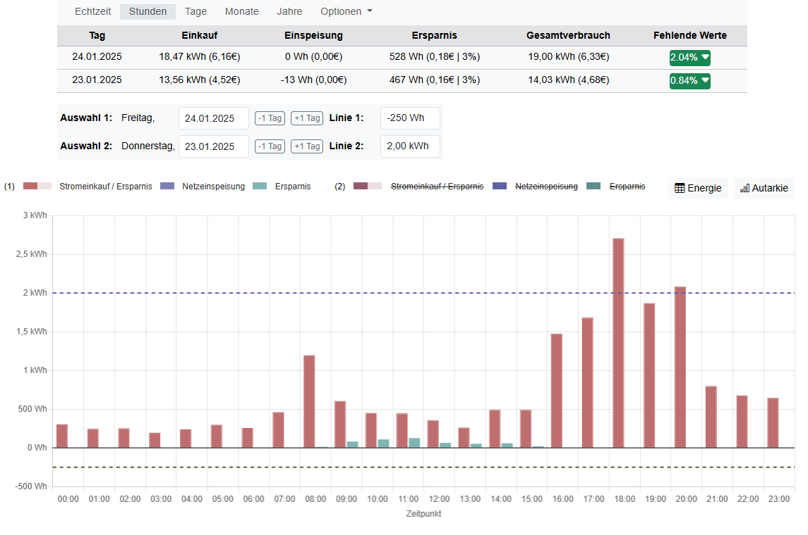
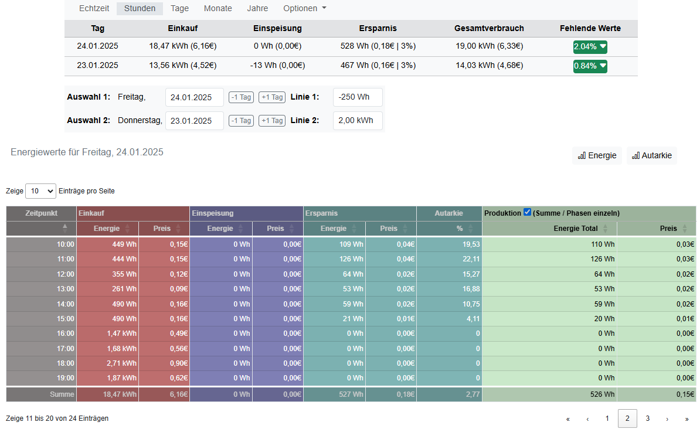
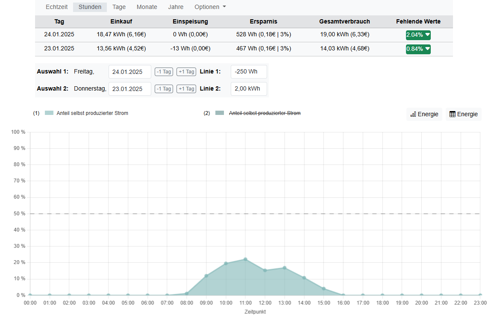
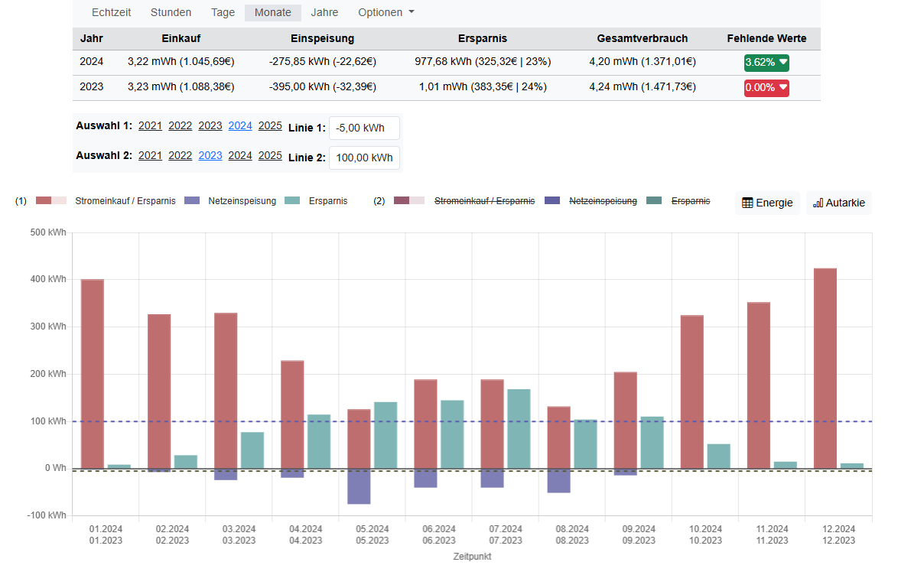
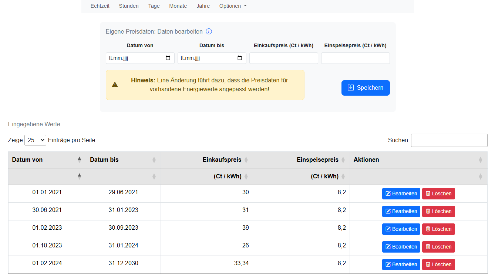

# Energie-Visualisierung für zu Hause
Eine Beschreibung ist hier [readme.md](./README.md) zu finden.

# Echtzeitansicht

Zeigt die in Echtzeit (z. B. alle 2 Sekunden) erfassten Energiewerte. Ermöglicht die Analyse der Werte durch zwei einstellbare Watt-Linien.

# Stundenübersicht - Diagram

Zeigt den Verbrauch in einer Stundenübersicht. Aus Performancegründen werden aufsummierte Werte aus den Echtzeitdaten verwendet. Es können zwei Zeitabschnitte dargestellt werden.

# Stundenübersicht - Datentabelle

Zeigt die Stundendaten in einer Tabelle an. Alle Übersichtsseiten bieten die Tabellenansicht, hier nur exemplarsich die für Stundenansicht.

# Stundenübersicht - Autarkie (Selbstversorgung)

Zeigt die Autarkie (Selbstverssorgungsrate) in Prozent für die erste Auswahl als Chart dar. Alle Übersichtsseiten bieten die Autarkieansicht, hier nur exemplarsich für die Stundenansicht.

# Tagesübersicht

Zeigt den Verbrauch in einer Tagesübersicht. Aus Performancegründen werden aufsummierte Werte aus den Echtzeitdaten verwendet. Es können Tage aus zwei unterschiedlichen Monaten dargestellt werden.

# Monatsübersicht

Zeigt die Daten wie in den anderen Ansichten, jedoch in einer Monatsübersicht. Es können die Monate aus zwei unterschiedlichen Jahren dargestellt werden.

# Eigene Energiewerte

Hier können eigene Energiewerte für einen Tag oder einen Monat eingegeben werden.

# Eigene Strompreisdaten

Hier können eigene Strompreisdaten für einen Zeitraum von mindestens einem Tag bis hin zu mehreren Monaten eingegeben werden. Es sind sowohl Einkaufs- als auch Einspeisepreise (Verkaufspreise) möglich.

# Status der fehlenden Energiewerte

Es wird ein Status der fehlenden Energiewerte angezeigt. Bei manueller Eingabe können diese nachgepflegt werden. Bei Echtzeitdaten kann es helfen, diese nachzuberechnen, falls der Cronjob für die Berechnung ausgefallen ist. Fehlen Echtzeitdaten, können diese leider nicht nachträglich erzeugt werden.
