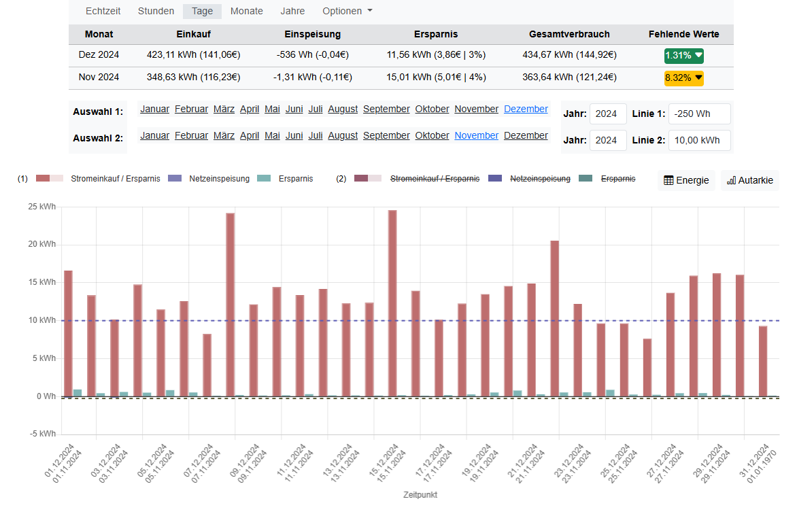

# Energie-Visualisierung für zu Hause
Eine Beschreibung ist hier [readme.md](./README.md) zu finden. Exemplarisch wird bei einigen Ansichten auch die mobile Version gezeigt.

# Echtzeitansicht
Zeigt die in Echtzeit (z. B. alle 2 Sekunden) erfassten Energiewerte. Ermöglicht die Analyse der Werte durch zwei einstellbare Watt-Linien.

**Desktop**

**Mobil**

**Desktop: Beispiel Regelansicht Nulleinspeisung mit Ceranfeld**
Hier kann man erkennen, wie lange ein Akkusystem mit Nulleinspeisung benötigt, um den Energiebedarf des Hause aus dem Akku zu nachzuregeln. 

**Desktop: Beispiel Nulleinspeisung über 1 Stunde**
Ein anderes Beispiel mit einer Stunde Nulleinspeisung. Man erkennt, das das System lediglich ~20Wh aus den Netz einkauft und den restlichen Bedarf selbst abdeckt.

# Stundenübersicht - Diagram
Zeigt den Verbrauch in einer Stundenübersicht. Aus Performancegründen werden aufsummierte Werte aus den Echtzeitdaten verwendet. Es können zwei Zeitabschnitte dargestellt werden.

**Desktop**

**Mobil**

# Stundenübersicht - Datentabelle
Zeigt die Stundendaten in einer Tabelle an. Alle Übersichtsseiten bieten die Tabellenansicht, hier nur exemplarsich die für Stundenansicht.

**Desktop**

# Stundenübersicht - Autarkie (Selbstversorgung)
Zeigt die Autarkie (Selbstverssorgungsrate) in Prozent für die erste Auswahl als Chart dar. Alle Übersichtsseiten bieten die Autarkieansicht, hier nur exemplarsich für die Stundenansicht.

**Desktop**

# Stundenübersicht - Autarkie (Eigenverbrauchsquote)
Zeigt die Eigenverbrauchsquote in Prozent für die erste Auswahl als Chart dar. Alle Übersichtsseiten bieten die Autarkieansicht, hier nur exemplarsich für die Stundenansicht.

**Desktop**

# Tagesübersicht
Zeigt den Verbrauch in einer Tagesübersicht. Aus Performancegründen werden aufsummierte Werte aus den Echtzeitdaten verwendet. Es können Tage aus zwei unterschiedlichen Monaten dargestellt werden.

**Desktop**

# Monatsübersicht
Zeigt die Daten wie in den anderen Ansichten, jedoch in einer Monatsübersicht. Es können die Monate aus zwei unterschiedlichen Jahren dargestellt werden.

**Desktop**

# Eigene Energiewerte
Hier können eigene Energiewerte für einen Tag oder einen Monat eingegeben werden.

**Desktop**

# Eigene Strompreisdaten
Hier können eigene Strompreisdaten für einen Zeitraum von mindestens einem Tag bis hin zu mehreren Monaten eingegeben werden. Es sind sowohl Einkaufs- als auch Einspeisepreise (Verkaufspreise) möglich.

**Desktop**

# Status der fehlenden Energiewerte
Es wird ein Status der fehlenden Energiewerte angezeigt. Bei manueller Eingabe können diese nachgepflegt werden. Bei Echtzeitdaten kann es helfen, diese nachzuberechnen, falls der Cronjob für die Berechnung ausgefallen ist. Fehlen Echtzeitdaten, können diese leider nicht nachträglich erzeugt werden.

**Desktop**

# Status der automatischen Jobs
Hier wird der Status der automatischen Jobs angezeigt.
Im Fehlerfall ist rechts oben in der Navigation ein Hinweis mit einem Link zu dieser Seite zu sehen.
Auf dieser Seite wird die entsprechende Zeile dann rot gefärbt, z.B. wenn keine Daten von einem der Shellys übertragen werden. 
Wenn entsprechend konfiguriert wird in diesem Fall auch eine Fehlermail versendet.

