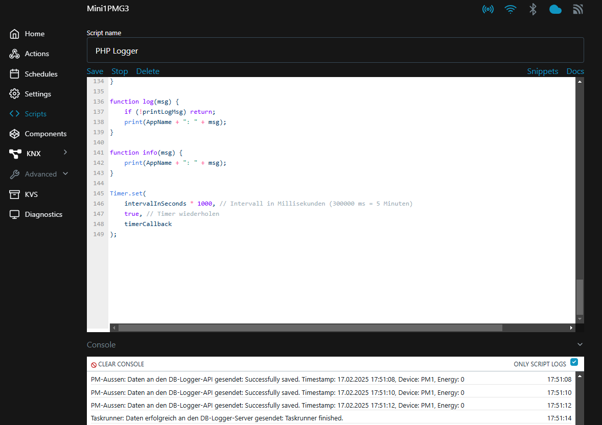

# NrgHomeVis
Energie-Visualisierung für zu Hause, Beschreibung siehe hier [readme.md](./README.md).

## Installationshilfen

**Häufige Fehler**
- Sieht die Seite anders aus als auf den Screenshots? Überprüfen, ob ein Slash (/) am Ende vom Wert URL_PREFIX in der local.config.php steht, 
Bsp: define('URL_PREFIX', 'http://meine.domain/mein-pfad/');

**Lokale Oberfläche der Shelly-Geräte aufrufen**
Die lokale Oberfläsche der Shelly-Geräte ruft man mit Hilfe der IP-Adresse auf. Die IP-Adresse kann über die Shelly-App wie folgt herausgefunden werden:
- App öffnen und Gerät auswählen
- Der untersten Menüpunkt 'Einstellungen' aufrufen
- Hier wieder den untersten Punkt 'Geräteinformationen' wählen
- IP-Adress ablesen unter 'Geräte-IP', meist 192.168.178.xxx
- Adresse im Browser aufrufen: http://192.168.178.xxx

Script einrichten:
- Menüpunkt 'Scripts' aufrufen und dann 'Create script'
- Scriptnamen vergeben und entsprechendes Script reinkopieren
- Konfiguration oben anpassen, wie URL, API-Key

**Häufige Fehler im Zusammenhang mit Shelly-Scripten**
- Stimmt der API-Key der Shelly Scripte mit dem Key in der local-config.php überein?
- Wurde das richtige Protokoll und die richtige URL zur API in den Shelly-Scripte eingetragen? Erste Zeile logging URL: http oder https?
- Die Logging-URL kann im Browser getestet werden. 
  - Ist diese korrekt, so wird die Meldung: Method not supported ausgegeben.
  - Ist der API-Key falsch, so wird: forbidden ausgegeben.
- Ist das API-Verzeichnis doch per htaccess geschützt. Hier muss die .htacess-Datei mit 'Required all grantend' enthalten sein, wie im Repo hinterlegt.
Es werden Echtzeidaten angezeigt, aber keine aufsummierten Daten in der Stundenübersicht und anderen Übersichten? Wurde das Script für den TaskRunner korrekt eingerichtet? (Auf dem Shelly oder per CronJob)
- Ist bei den PM-Geräte die devicePhase nicht gesetzt (auf 1, 2 oder 3), so kommt in der Logausgabe folgende Meldung: 'Fehler beim Senden der Daten: Error saving data: Ungültiger Gerätetyp: PM'
- Haben alle Logger-Scripte das gleichen Interval? (let intervalInSeconds = 2;)
- Ist ein Shelly ggfls. falsch angeschlossen und müssen die Werte invertiert werden? let invertSign = false;

**Logging bei den Shelly-Scripten aktivieren**

Jedes Shelly-Gerät kann Logausgaben ausgeben. Dafür muss die Logausgabe einmal aktiviert werden. Eine Beschreibung ist [hier](https://community.shelly.cloud/topic/1707-how-to-enable-debug-mode-on-your-shelly/) zu finden.

Die Logmeldungen können gut auf der Skriptseite angezeigt werden, so in etwas sollten diese Aussehen.

**Daten manuell per Powershell senden**

*Diese Methode ist für erfahrene Benutzer gedacht.*

In dieser [Datei](./scripts/shelly-scripts/POST_an_logger_per_Powershell.txt) ist ein Beispiel, wie man Daten manuell per Powershell vom lokalen Rechner senden kann. 

Die URI muss entsprechend angepasst werden, auf den Wert der 'loggingUrl'. auf dem lokalen PC dann Powershell starten und die Zeilen reinkopieren. Das Datum sollte weit in der Zukunft liegen, Z.b. im  Jahre 2055.
Die Ausgabe von 'response' sollten bei der Fehlersuche weiterhelfen.

Konnte die Daten korrekt gesendet werden, so sieht man auf Optionen->Status  Übersicht im Zeitraum der vorhandenen Echtzeitdaten die Zeit die gesendet wurde, z.B. 2055.

Ist alles korrekt, so muss der erzeugte Eintrage manuell per SQL in der Datenbank gelöscht werden, z.B.:

ACHTUNG: Genau auf das Datum und das WHERE achten, um nicht bereits vorhandene Daten zu löschen. Ggfls. ein Datenbank update anfertigen.

**Schritt 1: Überprüfen, ob die richtige Zeile ausgewählt wird**

SELECT * 
FROM real_time_energy_data 
WHERE TIMESTAMP >= "2055-12-12"
ORDER BY timestamp DESC 
LIMIT 10;

**Schrit 2: Löschen der Testdaten aus der Zukunft**
DELETE
FROM real_time_energy_data 
WHERE TIMESTAMP >= "2055-12-12"
